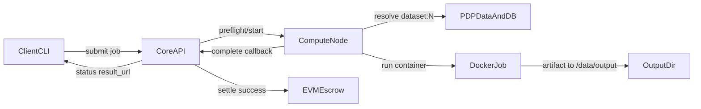

# Architecture

## Components

- **Client**: uploads input to PDP, submits jobs, prepares optional S3 presigned URLs.
- **Core**: job API, state machine, escrow checks/settlement.
- **Node**: dataset resolve/retrieve, Docker run, result callback.
- **Escrow**: balance-based payment (`deposit`, `settleSuccess`).
- **Storage**: node self-hosted output and/or client-owned S3.

## Data and control planes

| Plane | Path | Purpose |
|---|---|---|
| Control | Client -> Core -> Node | Scheduling, state transitions, callbacks. |
| Data | PDP -> Node container mount | Input data access close to compute. |
| Settlement | Core -> Escrow contract | Final CU charge and node payout. |
| Result delivery | Node output or S3 URL | End-user retrieval of logs/artifacts. |

## Compute path details

1. Node resolves `dataset:N` to piece metadata via Curio/Yugabyte.
2. Retrieval path materializes input into local mount directory.
3. Container starts with requested image/command/env and resource constraints.
4. Stdout and optional artifact files are collected.
5. Completion payload includes metrics (`wall_seconds`, `cpu_seconds`, `memory_mb_peak`) and `cu_used`.

## Why this architecture works for hackathon constraints

- Uses real PDP-backed data movement constraints, not mock file reads.
- Keeps billing and compute decoupled via clear callback and settlement boundary.
- Supports both simple stdout workloads and artifact-heavy ML jobs.
