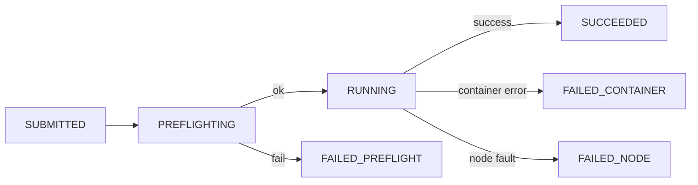

# Job Lifecycle

## Success path

1. Client submits job with `dataset_id`.
2. Core validates request and checks escrow balance.
3. Node preflight resolves dataset and checks data availability.
4. Node runs Docker job.
5. Node uploads artifact (optional S3 presigned flow).
6. Node sends COMPLETE.
7. Core marks `SUCCEEDED` and settles escrow asynchronously.

## Lifecycle with retry-safe keys

| Key | Scope | Why |
|---|---|---|
| `client_request_id` | submit | deduplicate repeated client submits |
| `job_id` | execution | stable job identity across retries |
| `attempt_id` | callback/settlement | prevent double application of completion |

## Terminal-state billing intent

| Terminal state | Meaning | Billing intent |
|---|---|---|
| `SUCCEEDED` | Work completed and result produced | charge `cu_used` |
| `FAILED_CONTAINER` | Job code failed or artifact upload failed | charge `cu_used` |
| `FAILED_NODE` | infra/callback reliability failure | refund path |
| `FAILED_PREFLIGHT` | not started on node | no charge |

## Practical polling model

- Client polls `GET /jobs/:job_id` until terminal status.
- If callback retried by node, Core handles it idempotently.
- Settlement may finalize slightly after status transition due to async chain confirmation.
