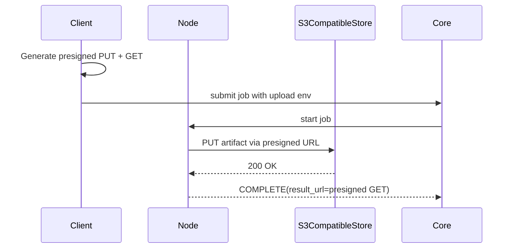

# Storage Modes

## A) Node-hosted output

- `OUTPUT_UPLOAD_BACKEND=self`
- stdout: `GET /output/:job_id`
- files: `GET /output/:job_id/files/:filename` (requires `JOB_OUTPUT_DIR`)

## B) Client-owned S3 (recommended)

- Client generates presigned PUT/GET URLs at submit time.
- Node uploads artifact to PUT URL after successful compute.
- Core stores GET URL as canonical `result_url`.
- Client pays S3 storage and transfer costs.

## Result URL behavior

| Mode | `result_url` points to | Best for |
|---|---|---|
| Node stdout | Node `GET /output/:job_id` | logs-first workflows |
| Node artifact file | Node `GET /output/:job_id/files/:filename` | quick local binary retrieval |
| S3 mode | Presigned GET URL | client-controlled retention/costs |

## YAML snippet

```yaml
storage:
  provider: s3
  bucket: akave-o3-results
  region: us-east-1
  key_prefix: jobs
  expires_seconds: 3600
  endpoint: https://o3-rc3.akave.xyz
```

## Notes

- Do not include bucket name inside `key_prefix`.
- If `storage.filename` is omitted, node defaults to `<job_id>.zip`.
- Node upload failure to presigned PUT URL is treated as execution failure.

## S3 mode flow


