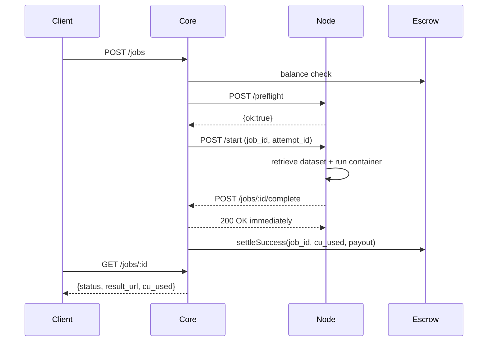

# Protocol and API

This page captures the concrete wire-level flow between Client, Core, and Node.

## Endpoints

### Core API

- `GET /health` -> liveness.
- `GET /config` -> escrow RPC/contract/CU rate for clients.
- `POST /jobs` -> submit job.
- `GET /jobs/:job_id` -> poll status/result.
- `POST /jobs/:job_id/complete` -> callback from node.

### Node API

- `GET /health` -> liveness.
- `POST /preflight` -> validate capacity + dataset availability.
- `POST /start` -> execute job.
- `GET /output/:job_id` -> stdout payload.
- `GET /output/:job_id/files/:filename` -> artifact download from node output dir.

## Submission payload (Core `POST /jobs`)

```json
{
  "nodeid": "node-001",
  "cid": "dataset:12909",
  "client_address": "0xabc...def",
  "compute_requirements": { "cpu_cores": 2, "memory_mb": 4096 },
  "docker": {
    "image": "python:3.11-slim",
    "command": ["python", "-c", "print('hello')"],
    "env": { "RESULT_FILENAME": "model.zip" }
  },
  "timeout_by": 1800,
  "max_cost_cu": 1200,
  "client_request_id": "demo-001",
  "result_storage": "s3"
}
```

## Execution callback payload (Node -> Core `POST /jobs/:job_id/complete`)

```json
{
  "job_id": "12218",
  "attempt_id": "attempt-12218-1",
  "status": "SUCCESS",
  "metrics": {
    "wall_seconds": 42.1,
    "cpu_seconds": 81.0,
    "memory_mb_peak": 1536
  },
  "cu_used": 212.4,
  "result_cid": "bafy...",
  "result_url": "https://.../output/12218/files/12218.zip"
}
```

## Sequence



## Idempotency and exactly-once

- Client-level idempotency key: `client_request_id`.
- Attempt-level idempotency key: `(job_id, attempt_id)`.
- Settlement is guarded to avoid double-charge on retries.

## Important behavior

- Core returns `200 OK` quickly on `SUCCESS` callback, then settles in background to avoid reverse proxy timeouts.
- On container errors, job transitions to `FAILED_CONTAINER` with bounded `logs_tail`.
- With `storage.provider=s3`, node upload failure marks job as failure (no silent success).
